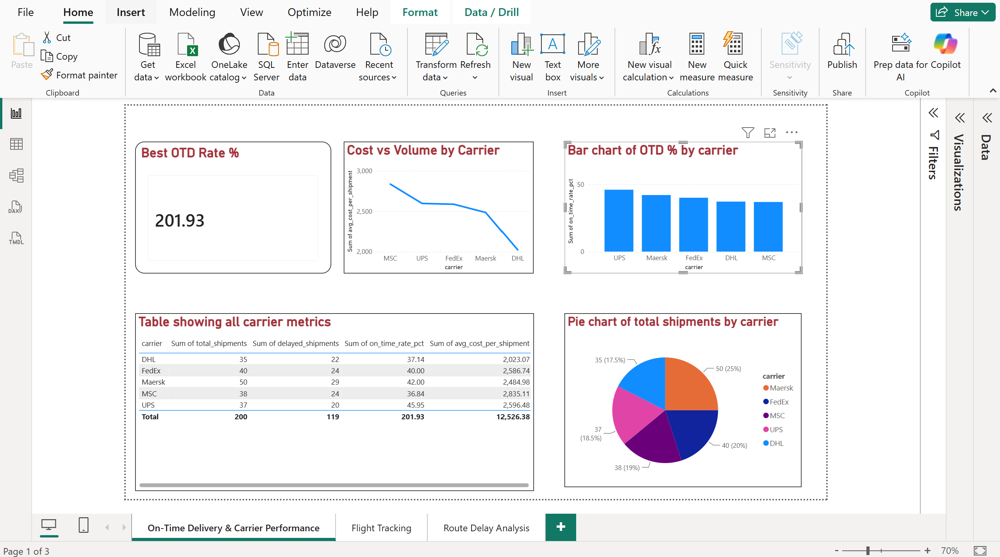
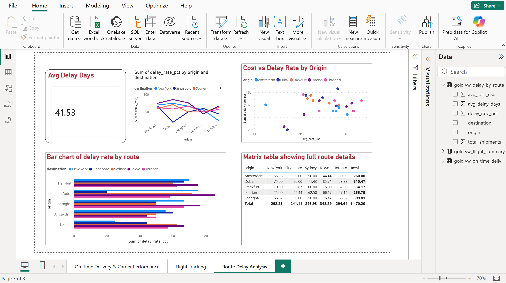
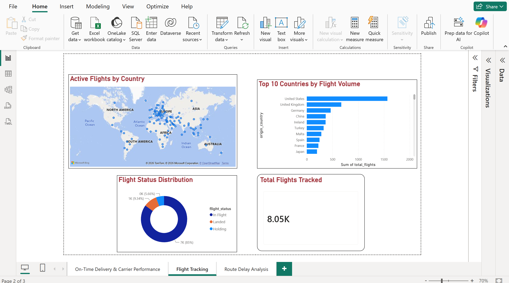

# Azure End-to-End Logistics Data Platform

A cloud-native, production-grade data pipeline built on Microsoft Azure — ingesting 
real-time flight and shipment data, transforming it through a Medallion Architecture, 
and delivering business insights via Power BI dashboards.

---

## Dashboards

### On-Time Delivery & Carrier Performance


### Route Delay Analysis


### Flight Tracking


---

## Architecture
```
Data Sources
  ├── OpenSky Network API (live flight data — 8,000+ aircraft)
  └── CSV Batch Files (shipment records)
          ↓
  Bronze Layer (ADLS Gen2)
  Raw, unmodified data partitioned by date
          ↓
  Silver Layer (ADLS Gen2 + Databricks)
  Cleaned, validated, enriched Delta tables
          ↓
  Gold Layer (ADLS Gen2 + Databricks)
  Aggregated business KPIs in Delta format
          ↓
  Synapse Analytics (Serverless SQL)
  SQL views over Gold Delta tables
          ↓
  Power BI Dashboards
  Live business intelligence
```

## Tech Stack

| Layer | Technology |
|---|---|
| Ingestion | Python, Azure Data Factory, OpenSky API |
| Storage | Azure Data Lake Storage Gen2 |
| Transformation | Azure Databricks, PySpark |
| Serving | Azure Synapse Analytics (Serverless SQL) |
| Visualisation | Power BI Desktop |
| Security | Azure Key Vault, Managed Identity |
| Containerisation | Docker, Azure Container Registry |
| Orchestration | Kubernetes (AKS manifests) |
| Version Control | Git, GitHub |
| API Testing | Postman |

---

## Project Structure
---

## Key Business Insights for 12.06.2026

### Carrier Performance
- **Best OTD rate:** UPS at 45.95%
- **Worst OTD rate:** MSC at 36.84%
- **Most expensive carrier:** MSC at $2,835 avg cost per shipment

### Route Analysis
- **Highest delay rate:** Dubai → Tokyo at 85.71%
- **Most reliable route:** London → New York at 25% delay rate
- **Overall delay rate:** 59.5% of shipments delayed

### Flight Tracking
- **8,054 live aircraft** tracked in real time
- **Top country:** United States with 1,337 active flights
- **UAE flights** average 813 km/h — fastest in dataset

---

## Azure Resources

| Resource | Name | Purpose |
|---|---|---|
| Resource Group | rg-logistics-platform | Container for all resources |
| ADLS Gen2 | stlogisticsplatform | Data lake (Bronze/Silver/Gold) |
| Data Factory | adf-logistics-platform | Pipeline orchestration |
| Databricks | dbw-logistics-platform | PySpark transformation |
| Synapse Analytics | synw-logistics-etl | SQL serving layer |
| Key Vault | kv-logistics-platform | Secrets management |
| Container Registry | acrlogisticsplatform | Docker image storage |

---

## How to Run

### Prerequisites
- Python 3.12+
- Azure CLI
- Docker Desktop
- Azure subscription

### Setup
```bash
# Clone the repository
git clone https://github.com/ziyaratmahmudzade/azure-logistics-platform.git
cd azure-logistics-platform

# Install dependencies
pip install -r requirements.txt

# Login to Azure
az login

# Run API ingestion
python ingestion/api/opensky_ingestion.py

# Run batch ingestion
python ingestion/batch/batch_ingestion.py
```

### Docker
```bash
# Build image
docker build -t logistics-ingestion .

# Run API ingestion container
docker run logistics-ingestion python ingestion/api/opensky_ingestion.py
```
### Kubernetes
```bash
# Apply namespace
kubectl apply -f kubernetes/namespace.yaml

# Deploy API ingestion CronJob (runs every 15 minutes)
kubectl apply -f kubernetes/api-ingestion-cronjob.yaml

# Deploy batch ingestion CronJob (runs daily at 6am)
kubectl apply -f kubernetes/batch-ingestion-cronjob.yaml
```
---

## Author
Ziyarat Mahmudzade  
[GitHub](https://github.com/ziyaratmahmudzade)

---